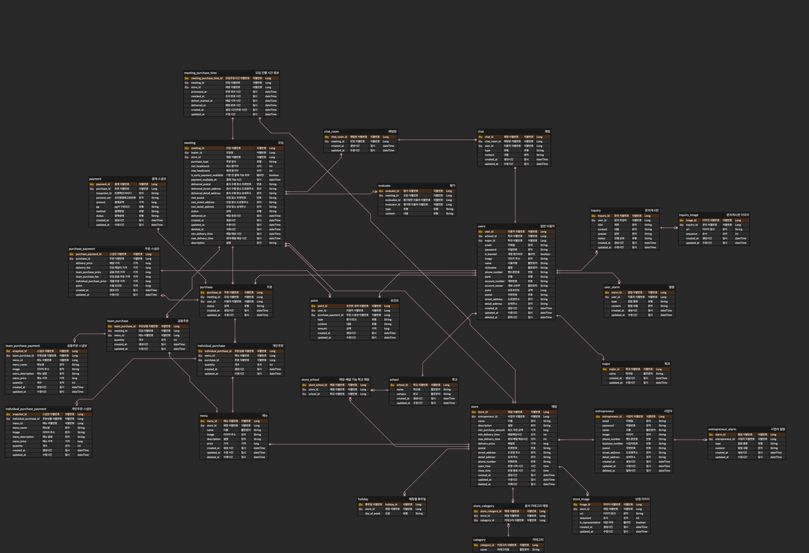

# 밥드실분  BackEnd Repository
- [소개(Notion)](https://chaen-notio.notion.site/29c9baa2ab4141bab4855cdb634fe565?pvs=4)
- [배포(Homepage)](https://bdsb-frontend.vercel.app/)
- [API 명세서(Swagger)](http://3.34.19.176:8080/swagger-ui/index.html)

## Development Environment

     

 

## Tech Stack

        

 

## Infrastructure & DevOps

     

 

## Tools & Collaboration

       

 

## Architecture

 

## ERD

